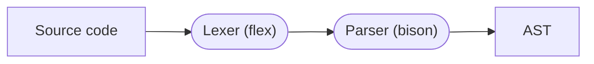
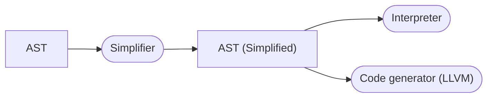

# Compiler flow

End to end, the Forge compiler.

## Syntax

```mermaid
flowchart LR
    source_code["Source code"] --> lexer
    lexer(["Lexer (flex)"]) --> parser
    parser(["Parser (bison)"]) --> ast
    ast[AST]
```

## Semantics

```mermaid
flowchart LR
    ast[AST] --> simplifier
    simplifier([Simplifier]) --> simplified_ast
    simplified_ast["AST (Simplified)"] --> interpreter
    interpreter([Interpreter])
    simplified_ast --> code_generator
    code_generator(["Code generator (LLVM)"])
```
