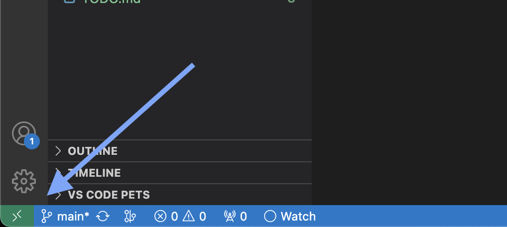
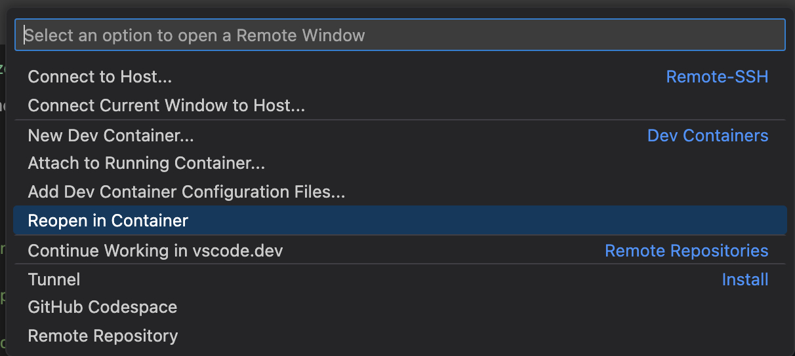
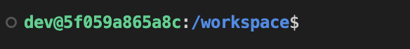

<!--
This program is free software: you can redistribute it and/or modify it under the terms
of the GNU General Public License as published by the Free Software Foundation, either
version 3 of the License, or (at your option) any later version.

This program is distributed in the hope that it will be useful, but WITHOUT ANY
WARRANTY; without even the implied warranty of MERCHANTABILITY or FITNESS FOR A
PARTICULAR PURPOSE. See the GNU General Public License for more details.

You should have received a copy of the GNU General Public License along with this
program. If not, see <https://www.gnu.org/licenses/>.

Copyright 2023-2024 Sophie Katz
-->

# Using the Dockerized development environment in VS Code

Forge is packaged with a Docker environment that is recommended for development with a standardized environment. It is built into the VS Code configuration for the repository.

To start, click on the remote menu button in the bottom left corner of the VS Code window:

Then from the menu, select _"Reopen in Container"_:

It may take a few minutes when opening for the first time because it has to built the Docker image. Once this is done, you should be able to open a terminal and see this prompt:

