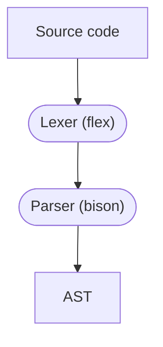
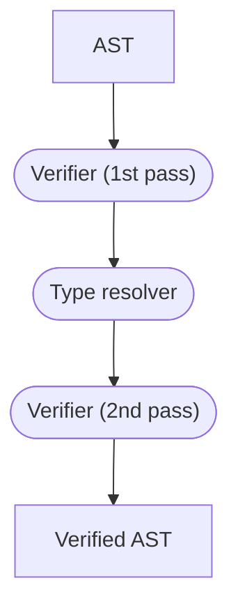
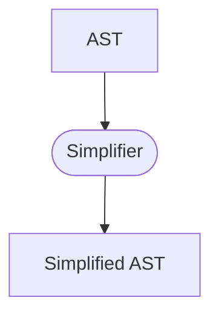
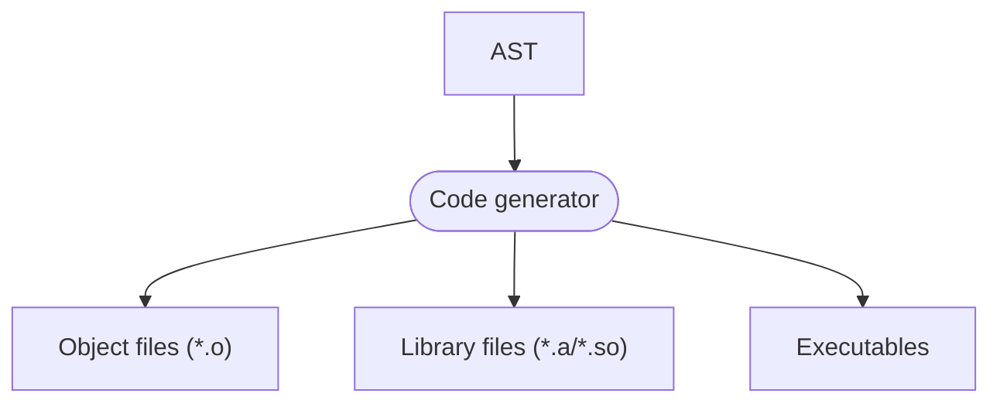

<!--
This program is free software: you can redistribute it and/or modify it under the terms
of the GNU General Public License as published by the Free Software Foundation, either
version 3 of the License, or (at your option) any later version.

This program is distributed in the hope that it will be useful, but WITHOUT ANY
WARRANTY; without even the implied warranty of MERCHANTABILITY or FITNESS FOR A
PARTICULAR PURPOSE. See the GNU General Public License for more details.

You should have received a copy of the GNU General Public License along with this
program. If not, see <https://www.gnu.org/licenses/>.

Copyright 2023-2024 Sophie Katz
-->

# Compiler flow

From start to finish, the compiler takes these steps:

- Parsing
- Verification
- Simplification
- Code generation

> [!WARNING]  
> Not all of this is implemented yet. This is an ideal future state.

## Parsing

Parsing starts off with source code and ends up with an abstract syntax tree (AST). This phase ensures that the syntax is correct but does nothing to further verify the code.

The compiler uses Flex for lexing and Bison for parsing.

## Verification

Once parsing is complete, we need to run a series of verifications on the code. They run in two passes.

The first pass makes sure that the AST is correct enough for the type resolver to perform type inference.

The second pass verifies everything else.

## Simplification

Simplification removes syntactic sugar from the AST. This makes the code easier to work with in the next phase.

## Code generation

At this point, the AST is ready to be passed to the code generator. This phase will output object files, library files, or executables.

